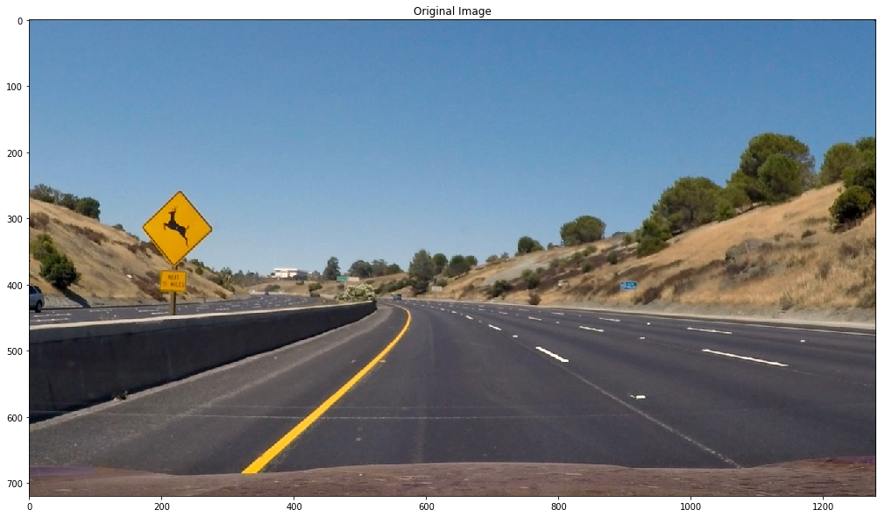

## Writeup

---

**Advanced Lane Finding Project**

The goals / steps of this project are the following:

* Compute the camera calibration matrix and distortion coefficients given a set of chessboard images.
* Apply a distortion correction to raw images.
* Use color transforms, gradients, etc., to create a thresholded binary image.
* Apply a perspective transform to rectify binary image ("birds-eye view").
* Detect lane pixels and fit to find the lane boundary.
* Determine the curvature of the lane and vehicle position with respect to center.
* Warp the detected lane boundaries back onto the original image.
* Output visual display of the lane boundaries and numerical estimation of lane curvature and vehicle position.

[//]: # (Image References)

[image1]: ./examples/undistort_output.png "Undistorted"
[image2]: ./test_images/test1.jpg "Road Transformed"
[image3]: ./examples/binary_combo_example.jpg "Binary Example"
[image4]: ./examples/warped_straight_lines.jpg "Warp Example"
[image5]: ./examples/color_fit_lines.jpg "Fit Visual"
[image6]: ./examples/example_output.jpg "Output"
[video1]: ./project_video.mp4 "Video"

## [Rubric](https://review.udacity.com/#!/rubrics/571/view) Points

### Here I will consider the rubric points individually and describe how I addressed each point in my implementation.  

---

### Writeup / README

#### 1. Provide a Writeup / README that includes all the rubric points and how you addressed each one.  You can submit your writeup as markdown or pdf.  [Here](https://github.com/udacity/CarND-Advanced-Lane-Lines/blob/master/writeup_template.md) is a template writeup for this project you can use as a guide and a starting point.  

You're reading it!

### Camera Calibration

#### 1. Briefly state how you computed the camera matrix and distortion coefficients. Provide an example of a distortion corrected calibration image.


The code for this step is in P2 ipython notebook. You can find the code in the beginning of notebook with the heading **Camera Calibration**. 

To be calibrate camera we'll use photos of chessboards given in ./camera_cal directory. By using `cv2.findChessboardCorners()` we will find out coordinates of chessboard corners in each image. Then we will create mapping for those points in real 3D space using `np.mgrid()` by considering that each point (x,y,z) lies in a planes z=0. Then by using image point and object point mappings we will calculate camera matrix and distortion co-efficients by using `cv2.calibrateCamera()`. Now we can undistort any image captured by the same camera that took calibration images, by using `cv2.undistort()`.
After that I have encapsulated the code in `undistort()` function, so that we can use it without keeping track of camera matrix and distortion co-efficients.


### Pipeline

#### 1. Provide an example of a distortion-corrected image.

First step in our advanced lane finding pipeline is to remove any kind of distortion created by lense. I have implemented a function called `undistort`, which I use throughout the code to remove distortion from the images.
To demonstrate this step, I will describe how I apply the distortion correction to one of the test images like this one:

`img = mpimg.imread('test_images/test1.jpg')
undistorted_img = undistort(img)
plt.imshow(undistorted_img)`

test1.jpg distorted             |  test1.jpg undistorted
:-------------------------:|:-------------------------:
 |  

Although it's very difficult to notice difference between both.

#### 2. Describe how (and identify where in your code) you used color transforms, gradients or other methods to create a thresholded binary image.  Provide an example of a binary image result.

For the thresholding, I implemented all varient of sobel thresholding and channel isolation for both RGB and HLS. You can find the code in cell with the heading **Thresholding**. Below are the various thresholds applied on `test_images/test2.jpg`


 


Then comes the very important part of combining these diffrent thresholds.

For Sobel Threhold we will consider absolute sobel in X direction as whenever road lanes lines
appear in an image, its gradient in x direction abruptly changes. So we will combine sobelX and sobel_dir

`sobel_threshold = (sobelX == 1) & (sobel_dir == 1)`

For color threshold we will choose channel R and G as they detect yellow lanes. We will consider R and G
channels only when there is ample lightness

`color_threshold = (R == 1) & (G == 1) & (L == 1)`

S channel appears to detect both yellow and white lanes with highest efficiency even in varying lighting conditions

`hls_threshold   = (S == 1)`

For the final combination of thresholds, either saturation or gradients must be present along with R and G channels

`output[color_threshold & (hls_threshold | sobel_threshold)] = 1`

I have encapsulated combined thresholding process in function called `combined_threshold`. You can find its code in cell with heading **Combining thresholds**

Output of `combined_threshold` for test_images/test2.jpg is below:


#### 3. Describe how (and identify where in your code) you performed a perspective transform and provide an example of a transformed image.

Code for Pespective transfom can be found in cell with heading **Perspective Transform**. To get the perspective transform, first, we will take a sample image which has straight road lanes and we will manually choose 4 points in the image whose transformed coordinates we can calculate. Then, we will use `cv2.getPerspectiveTransform()` to get transform matrix and inverse transform matrix. Finally, we can warp and unwarp the perspective by using transform matrix and inverse transform matrix along with `cv2.warpPerspective()`


```python
# Manually chosen points on source
src = np.array([[295,665],[415,580],[892,580],[1024,665]], np.float32)

# Manually calculted points for the destination
dst = np.array([[295,665],[295,580],[1024,580],[1024,665]], np.float32)
```

This resulted in the following source and destination points:

| Source        | Destination   | 
|:-------------:|:-------------:| 
| 295,665      | 295,665        | 
| 415,580      | 295,580      |
| 892,580    | 1024,580      |
| 1024,665      | 1024,665       |

I verified that my perspective transform was working as expected by drawing the `src` and `dst` points onto a test image and its warped counterpart to verify that the lines appear parallel in the warped image.


#### 4. Describe how (and identify where in your code) you identified lane-line pixels and fit their positions with a polynomial?

In this section we will find out pixels corresponding to the lane lines in a binary warped image. To find lane pixels we will first plot histogram histogram along all the columns in the lower half of the image. With this histogram we are adding up the pixel values along each column in the image. In our thresholded binary image, pixels are either 0 or 1, so the two most prominent peaks in this histogram will be good indicators of the x-position of the base of the lane lines. We can use that as a starting point for where to search for the lines. From that point, we can use a sliding window, placed around the line centers, to find and follow the lines up to the top of the frame.
My end results look like below:


You can find the code for lane detection in cell with heading **Lane Detection**

#### 5. Describe how (and identify where in your code) you calculated the radius of curvature of the lane and the position of the vehicle with respect to center.

You can find the code for lane detection in cell with heading **Measuring radius of curvature and center offset**. In the previous lane finding steps we calculated equation of lanes in the form `x = f(y)=Ay^2+By+C`.
I used the below formula to calculate the radius of curvature:


For the center offset I first calculate center of the lane and calculte its distance fromthe middle of the image. Then I convert difference in pixels to meters by a factor of 3.7/700 meters per pixel along the x axis.
#### 6. Provide an example image of your result plotted back down onto the road such that the lane area is identified clearly.

I encapsulated the whole pipeline in function called `pipeline()`. You can find its code in cell with the heading **Pipeline**.
Below is output of pipeline for test_images/straight_lines1.jpg


---

### Pipeline (video)

#### 1. Provide a link to your final video output.  Your pipeline should perform reasonably well on the entire project video (wobbly lines are ok but no catastrophic failures that would cause the car to drive off the road!).

Here's a [link to my video result](./project_video_output.mp4)

[](https://youtu.be/1bYxK7Uk8Qk)

---

### Discussion

#### 1. Briefly discuss any problems / issues you faced in your implementation of this project.  Where will your pipeline likely fail?  What could you do to make it more robust?

During the implementation thresholding is where I faced problems. I had to try so many threshold values to a the descent combined threshold. I faced some issues with perpective transform while selecting coordinates manually.

Pipeline is likely to fail on sharp turns, uphill or downhill climb as we can see in harder_challenge_video.mp4
